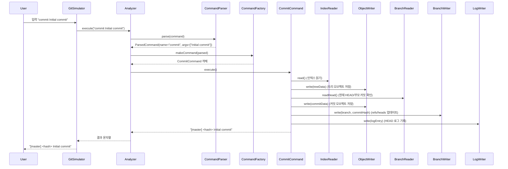

# Week2 미션 요구사항
## 🔥 미션 2주차 하면서 느낀점
- 코파일럿 쓰다가 능동성이 중요하다 깨달음

## 💢 아이디어
- 코드 가독성 높이는 프롬프트 활용 후 비교
- 코딩없이 AI 루틴 등록하고 사용해보기 (프롬프트만으로)
- `머메이드 라이브에디터` 를 AI 로 작성해서 다이어그램 그려보기!
  - `excalidraw` 에 코드를 붙여서 수정해보기!
- AI 친구만들기
  - 상황극 해보기
- AI 프롬프트 잘 해서 간단한 보드게임 플레이하기
- AI 에게 한줄 회고를 주어 영화 시나리오를 만들어달라고 하기
  - 분위기같은거 추가해서
  - 작가 문체 따라하기

## 📚 릴레이 프로젝트 2주차 미션
- 1단계: `머메이드 라이브에디터` 를 AI 로 작성해서 다이어그램 그려보기!
  - _(Optional)_ 2단계: `excalidraw` 에 코드를 붙여서 수정해보기!
- `학습 체크리스트` 마크다운으로 생성해보기
- 코드 가독성 높이는 프롬프트 활용 후 비교
- AI 에게 한줄 회고를 주어 영화 시나리오를 만들어달라고 하기
  - 분위기같은거 추가해서
  - 작가 문체 따라하기

## 미션 상세사항
### ✅ 퀘스트 1. AI로 다이어그램 마스터하기
- **1단계:** AI에게 Mermaid 코드 생성 요청하기  
    예: “AI야, Mermaid로 표현해줘”  
    결과: AI가 작성한 Mermaid 다이어그램 코드 받기
- **2단계:** Excalidraw로 시각화 & 커스터마이징  
  - Mermaid 코드를 Excalidraw에 붙여넣기
  - 색상, 레이아웃, 텍스트 등을 수정해서 가독성 향상
  - AI에게 “이 다이어그램 더 보기 좋게 개선해줘” 요청도 가능

### ✅ 퀘스트 2. 학습 체크리스트 마크다운 생성해보기
- 문제를 제공하고 거기서 필요한 배경지식의 학습 체크리스트를 생성해 따라가보기

### ✅ 퀘스트 3. 코드 가독성 높이는 프롬프트 활용 후 비교
- 더럽게 작성될 코드를 AI에게 깨끗하게 해달라고 해보기!
- 리드미 혹은 학습정리도 가능!

### ✅ 퀘스트 4. AI 시나리오 생성 챌린지
- “회고를 한 줄로 작성” → AI에게 영화 시나리오로 각색해달라고 요청하기
- 예: “오늘도 멀티스레드와 싸우다 아침해를 봤다.” + “영화 시나리오로 각색해줘”
    분위기, 작가문체 요구사항으로 주기도 가능
- 결과: 시네마틱 시나리오 (씬 구분 + 내레이션 + 감성 자막) 받기

# Week2 수행 기록
## 첫째
### S023_이대훈
- **퀘스트**: AI로 다이어그램 마스터하기
- **선택 이유**: 피어 컴파일링 과정에서 글로만 작성된 README, 학습 정리를 읽는 것보다 UML과 같이 시각화 된 자료가 있으면 전체 내용을 이해하는 것이 더 쉽게 느껴집니다. 이번 미션을 통해 함께 피어 피드백을 진행하는 팀원들에게 더 쉽게 이해할 수 있는 시각화 된 자료를 제공해 보고자 합니다.
- **결과**: 매 미션마다 구현을 완성하고 완성된 구조를 바탕으로 AI를 활용해 UML 및 시퀀스 흐름을 시각화 자료로 준비하였습니다. 이를 README.md에 추가하여 피어 컴파일링 하는 과정에서 전체 코드의 흐름을 쉽게 파악할 수 있도록 구성하였습니다.




- **인사이트**: 다이어그램을 AI에게 요청하기 위해서는 먼저 어떻게 프로젝트의 구조를 가지고 있는지 설명해야 합니다. 또는 전체 코드를 제공하고 AI가 유추할 수 있는 방식을 취해야 합니다. 저는 UML은 PlantUML 양식으로 시퀀스 다이어그램은 mermaid 양식으로 AI에게 요청을 하여 진행하였습니다. 각각의 다이어그램을 어떤 양식으로 표현할지 선택하는 것도 중요한 일이었습니다.
- **느낀 점**: 자료 구조의 역할과 SOLID 원칙에 따라 코드를 분리하고 프로토콜(인터페이스)를 생성하는 과정에서 파일의 수가 많이 늘어나는 경우가 있었습니다. 이 때문에 코드를 하나씩 읽을 때 이 자료 구조가 어디서 어떻게 동작하는지 유추하기가 어려운 경우가 있었습니다. 하지만 UML을 제공함으로써 이 프로젝트의 구조를 파악하고 시퀀스 다이어그램을 통해 각 객체가 어떻게 상호 작용하는 지를 먼저 눈으로 확인할 수 있어 코드 구조를 파악하고 읽는데 용이했습니다.
- **배운 점**: 글을 읽을 때 시각적인 자료의 활용이 얼마나 크게 읽는 이에게 영향을 주지는 확인할 수 있었습니다. 특히 코드를 하나씩 확인하기 전 전체 흐름을 확인할 수 있어 전체 흐름을 보고 이 코드가 어떤 역할을 할 것인지를 유추할 수 있었습니다.

## 둘째
### J280_하민영
- **퀘스트**: 학습 체크리스트 마크다운 생성해보기
- **선택 이유**: 체크리스트를 작성하는 데 시간이 오래 걸리기도 하고, 놓치는 항목도 생기기 마련입니다. 반복적인 항목 정리 작업은 AI가 잘하는 영역이라고 생각했고, 이를 통해 제가 집중해야 할 학습 포인트를 빠르게 도출해주는 도구로 AI를 활용해보고 싶었습니다.  
단순히 시간을 아끼는 것을 넘어서, 더 구조적이고 일관된 학습 흐름을 설계하는 능력도 함께 키워보고자 합니다.  
무엇보다 이 과정에서 "문제를 기준으로 어떤 배경지식을 학습해야 하는가?"를 AI와 협업하여 체계적으로 도출해보는 경험이, AI를 능동적으로 사용하는 설계자로 성장하는 데 큰 도움이 될 것이라 판단했습니다.  
- **과정**
  > **첫 프롬프트**  
  > [미션 내용]  
  > "이게 오늘 미션인데 학습해야할 체크리스트 좀 구성해줘"

  <details>
    <summary>GPT 대답</summary>
    좋습니다! 주어진 미션은 **Git의 내부 동작을 직접 구현해보고 개선하는 것**이므로, 다음과 같은 주제로 학습 체크리스트를 구성하면 좋습니다.
    ---
    
    ## ✅ 오늘의 미션 체크리스트: Git Object와 명령어 구현
    
    ### 1️⃣ Git 내부 구조 이해
    
    - [ ]  Git은 어떻게 데이터를 저장하는가? (`.git/objects`)
    - [ ]  Git의 4가지 주요 object 타입 이해하기
        - [ ]  `blob`: 파일의 내용
        - [ ]  `tree`: 디렉토리 구조
        - [ ]  `commit`: 커밋 정보
        - [ ]  `tag`: 태그 정보
    - [ ]  SHA1 해시 방식으로 Git object 식별하는 방법
    - [ ]  `zlib` 압축 방식 이해
    
    ### 2️⃣ Git 명령 분석 및 구현 대상 선정
    
    - [ ]  `git clone` 동작 방식 분석
        - [ ]  원격 저장소에서 데이터를 어떻게 받아오는가?
        - [ ]  `.git/objects`, `.git/config`, `.git/refs` 등 초기화 구조 이해
    - [ ]  구현할 명령 하나 선정 (예: `my-clone`, `my-add`, `my-commit`)
        - [ ]  어떤 object를 읽고 쓸 것인지 명확히 정의
    
    ### 3️⃣ Git object 직접 다뤄보기
    
    - [ ]  Git object 생성하기 (`blob`부터 시작 추천)
        - [ ]  `blob` 생성 → zlib 압축 → `.git/objects/` 경로에 저장
        - [ ]  `sha1` 해시 직접 계산 (`blob <size>\0<content>`)
    - [ ]  생성한 object가 Git 명령어로도 인식되는지 확인하기 (`git cat-file -p <hash>`)
    
    ### 4️⃣ 테스트 및 구조 개선
    
    - [ ]  하나의 타입(blob 등)에 대해 단위 테스트 작성
    - [ ]  기존 코드에서 의존성을 줄이고 모듈화하기
    - [ ]  테스트 커버리지 유지하며 구조 리팩토링
    
    ### 5️⃣ 해시 알고리즘 대체 실험
    
    - [ ]  SHA1 대신 나만의 해시 함수 구현
        - [ ]  동일 입력에 대해 고유 해시 출력
        - [ ]  충돌 방지를 위한 간단한 설계 원칙 수립
    - [ ]  새로운 해시 구조로도 object 저장 및 조회 가능하도록 만들기
    - [ ]  기존 SHA1 기반 구조와 비교 테스트 수행
    
    ### 6️⃣ 확장 아이디어 및 자율 개선
    
    - [ ]  `my-init`, `my-add`, `my-commit` 등 단계별 명령 확장
    - [ ]  `index` 파일 구조 학습 및 직접 조작
    - [ ]  object 간 관계 연결 (`tree`, `commit`) 구현 도전
    
    ---
    
    ## 🧠 참고 키워드 (학습용)
    
    - `zlib.deflateSync`, `crypto.createHash("sha1")`
    - `.git/index` 바이너리 구조
    - `git cat-file`, `git hash-object`, `git update-index`
    - Git plumbing 명령어 vs porcelain 명령어
    
    ---
    
    필요하면 각 항목별로 구체적인 설명이나 예시 코드도 제공할 수 있어요.
    
    어떤 항목부터 시작하고 싶으신가요?

  </details>
    

  > **두 번째 프롬프트**   
  > 아니 이미 구현은 어느정도 되어있어. 근데 AI 도움을 너무 많이 받아서 아예 다시 짤까 싶어.  
  > 일단은 add, init, status, commit은 구현되어 있고 거기에 위의 미션을 추가로 구현해야해. 해야하는 미션 체크리스트도 좋은데 학습 체크리스트 위주로 만들어줘.

  <details>
    <summary>GPT 대답</summary>

    좋습니다. 이미 일부 Git 명령어를 구현한 상태라면, **기능 확장과 구조 개선에 필요한 개념 위주의 학습 체크리스트**로 구성하는 것이 효과적입니다. 아래는 미션 수행 전후로 반드시 이해하고 있어야 할 내용을 정리한 학습 중심 체크리스트입니다.
    
    ---
    
    ## ✅ Git 내부 동작 학습 체크리스트
    
    ### 🔹 Git Object 구조와 저장 방식
    
    - [ ]  Git에서 `blob`, `tree`, `commit`, `tag`는 각각 어떤 역할을 하는가?
    - [ ]  `blob` 객체의 저장 형식: `"blob <size>\0<content>"` 구조 이해
    - [ ]  `tree` 객체의 바이너리 구조: `mode path\0SHA1` 포맷 이해
    - [ ]  `commit` 객체의 구성 요소 (`tree`, `parent`, `author`, `message`) 파악
    - [ ]  각 객체가 `.git/objects/xx/yyyy...` 형태로 저장되는 과정 학습
    
    ### 🔹 Git의 압축 및 해시 알고리즘
    
    - [ ]  Git이 SHA1 해시를 어떻게 사용하는지 이해하기
    - [ ]  `crypto.createHash('sha1')` 로 해시 생성하는 법
    - [ ]  `zlib`을 사용한 압축 및 해제 (`deflateSync`, `inflateSync`)
    - [ ]  해시 충돌과 무결성 체크의 개념
    
    ### 🔹 Git 명령어 동작 원리
    
    - [ ]  `git add` 시 `blob`과 `index` 파일은 어떻게 바뀌는가?
    - [ ]  `git commit` 시 `tree`와 `commit` 객체는 어떻게 생성되는가?
    - [ ]  `git status`는 어떤 파일과 비교해서 상태를 판별하는가?
    - [ ]  `git clone`은 `.git` 디렉토리를 어떻게 구성하는가?
    
    ### 🔹 Git index와 staging 영역
    
    - [ ]  `.git/index` 바이너리 구조 이해 (해당 구현을 더 확장할 수 있음)
    - [ ]  index에 등록된 파일이 실제 object로 매핑되는 방식
    
    ### 🔹 Git의 참조 시스템
    
    - [ ]  `.git/HEAD`, `.git/refs/heads/main`의 역할 이해
    - [ ]  `HEAD`가 가리키는 참조(ref)가 변경되며 커밋 히스토리가 쌓이는 구조 이해
    
    ---
    
    ## 🛠️ 추가 미션 수행을 위한 학습 키워드
    
    | 키워드 | 설명 |
    | --- | --- |
    | `git clone` 구조 분석 | 원격 저장소에서 받아온 object를 `.git/objects`에 쓰고 HEAD와 refs를 구성하는 방식 |
    | Git object 쓰기 | 직접 `blob`, `tree`, `commit` 구조를 만들고 저장해보는 실습 |
    | Git plumbing 명령어 | `hash-object`, `cat-file`, `update-index` 등 내부 동작 확인용 명령 |
    | 나만의 해시 함수 | SHA1 대신 해시함수를 만들어 무결성 판단을 실험해보는 기초 설계 학습 |
    | 단위 테스트 전략 | object 단위로 격리된 테스트를 구성하는 방식 (테스트 코드 설계 원리) |
    
    ---
    
    ## 🎯 학습 순서 추천
    
    1. **Git object 저장 포맷** 복습 → 직접 zlib 압축된 blob 생성
    2. `git clone`의 구조적 동작 순서 분석 → `.git` 폴더 수동 구성 실험
    3. **tree 및 commit 객체 생성 실습**
    4. **ref, HEAD, index 등 포인터 개념 정리**
    5. 나만의 해시 → 기존 SHA1과 비교 실험
    6. 객체 단위의 테스트 구조 설계
    
    ---
    
    필요하시면 각 항목별 예제 코드나 시각적 다이어그램도 함께 드릴 수 있어요.
    
    다음으로 어떤 학습 항목부터 정리해볼까요? (예: tree 객체 포맷, HEAD 구조 등)
  </details>    
    
- **결과** : 이 중에 골라서 미션을 선택함.
  ```md
  ### 학습 체크리스트
  1. SHA1 해시 방식으로 Git object 식별하는 방법
      - SHA256 방식으로 비교
      - crypto.createHash('sha1') 로 해시 생성하는 법
      - 해시 충돌과 무결성 체크의 개념 이해
  2. zlib 압축 방식 이해
      - zlib을 사용한 압축 및 해제 (deflateSync, inflateSync)
  3. Git 명령 분석 및 구현 대상 선정
  4. 바이너리 객체의 구조 mode path\0SHA1을 이해
  5. git clone은 .git 디렉토리를 어떻게 구성하는가?
  ```
- **느낀점** : AI가 제시하는 답변은 생각보다 간편하고 보기 좋았지만, 그만큼 내가 스스로 고민할 여지를 줄이기도 한다는 점에서 약간의 경계심도 들었다. 특히 ‘학습’을 원한다고 했음에도 구현 중심으로 답변이 나오는 걸 보며, 내가 원한 것과는 조금 어긋난 방향으로 흐를 수 있다는 점을 체감했다.
- **배운점** : AI에게 원하는 결과를 얻기 위해서는 초기 프롬프트에 맥락을 명확히 담는 것이 매우 중요하다는 걸 배웠다. 단순히 "이거 해줘"가 아니라, 내가 어떤 프로젝트를 하고 있는지, 현재 어느 단계인지, 어떤 응답은 원하지 않는지를 구체적으로 알려줘야 원하는 방향으로 이끌 수 있다는 점을 깨달았다.
- **인사이트** : AI는 문장의 의도보다는 예시와 구조에 더 민감하게 반응한다는 사실을 알게 되었다. '학습 체크리스트'를 요청했어도, 이전 응답이 구현 중심이었다면 그 구조를 따라가려는 경향이 있다는 걸 보며, 향후에는 반례를 함께 제시하거나, 원하는 형식의 구체적인 예시를 먼저 제공하는 것이 효과적인 프롬프트 설계 전략이 될 수 있겠다는 인사이트를 얻었다.


## 셋째
### J154_양성호
- **퀘스트**: AI로 다이어그램 마스터하기 & 코드 가독성 높이는 프롬프트 활용 후 비교  
- **선택 이유**: 미션을 수행하면서 다른 캠퍼분들의 Gist를 보았을 때 시각 자료의 유무가 가독성에 매우 큰 영향을 미치는 것을 절실히 느꼈습니다. 그래서 퀘스트 작성 단계에서 해당 내용이 반영되었었는데 여기서 1번 퀘스트를 통해 만나니 반가웠습니다. 1번 퀘스트에 더해 3번 퀘스트는 글이 잘 안써진다고 느껴질 때 시도해보려고 합니다. 이전에 AI에게 대필시킬 때 만족스럽지 못한 결과를 받았었는데, 이번 기회를 통해 직접 쓴 글과 비교해보고자 합니다.  
- **결과**: 미션에서 제시했던 Mermaid와 Excalidraw는 아니었지만, 비슷한 다이어그램 툴인 Draw.io를 활용하는데 AI의 도움을 받을 수 있었습니다. 줄글과 슈도코드로 작성한 설계를 AI에게 넘겨주고, Draw.io xml 파일을 요청하여 전체 설계를 담은 다이어그램 초안을 빠르게 받아볼 수 있었습니다. 비록 배치는 엉망진창이었지만 들어가야 할 도형과 화살표 연결은 완벽해서 다이어그램을 구성하는 시간을 크게 절약할 수 있었습니다.


- **인사이트**: '코드 가독성 높이는 프롬프트 활용 후 비교' 미션은 미처 수행하지 못했는데, 다음 주 긴 글을 써야하는 AI와의 피어 세션에서 수행해보면 좋을 것 같습니다.
- **느낀 점**:
  + 다이어그램 작성에서 제가 할 일은 적절히 배치만 하면 된다는 점에서 무척 만족스러웠습니다.
  + 생각보다 많은 시간을 학습과 큰 관련없는 부차적인 활동에 많이 사용하고 있음을 깨달았습니다.
  + 학습에 부차적인 절차들을 식별하여 AI에게 위임한다면 온전히 학습에 쓸 수 있는 시간을 더 확보할 수 있겠다는 생각을 하게 되었습니다. 
- **배운 점**:
  + AI를 활용할 때 어떤 활동이 나의 학습에 부차적이고, 어떤 활동이 필수적인지 파악하고 구분하는 과정이 꼭 필요하겠다는 생각이 들었습니다.
  + 설계 구조를 설명하는 과정 중 시각 자료가 시간 절약, 상대방의 이해, 문서의 가독성 등 여러 부분에서 큰 도움이 될 수 있음을 확인할 수 있었습니다.
  + 시각 자료의 유무가 매우 큰 영향력을 가진다는 것을 함께 피어 피드백을 진행한 동료 분들의 반응을 통해 다시 한번 확인할 수 있었습니다.

## 넷째
### J286_허세령
- **퀘스트**: 학습 체크리스트 마크다운 생성해보기
- **선택 이유**: 현재 체크리스트를 작성할 때, 주어진 요구사항을 따라 적는데에 그쳤습니다. 미션을 수행할 때 AI로 체크리스트를 생성해보면서 미션에 드러나있지 않은 학습 권장 CS 지식들을 잘 알려줄 것 같아서 AI의 체크리스트를 따라 학습을 해보고 싶습니다. 그리고, 직접 작성한 체크리스트랑 비교해보면서 내가 빠트린 부분이 어떤 부분이 있는지 개선점을 찾는 데에도 이용하고자 합니다.
- **과정**
  - **Day11**
      <details>
      <summary>GPT의 체크포인트</summary>
    
      # 🎯 학습 목표 및 기능 요구사항 정리
      
      ## ✅ 1. 학습해야 할 CS 지식
      
      ### A. 비동기 처리 & 이벤트 기반 시스템
      - [ ] Node.js 이벤트 루프 동작 방식
      - [ ] EventEmitter 활용법
      - [ ] Producer-Consumer 패턴
        - 대기 큐의 역할
        - Race Condition, Deadlock 문제와 해결
      - [ ] Promise, async/await의 흐름 제어
      - [ ] 단일 스레드 환경에서의 병렬 처리 구현 전략
      
      ### B. 시스템 설계 및 객체지향 설계
      - [ ] 모듈 책임 분리 (SRP)
      - [ ] 상태 전이(State Transition) 설계
      - [ ] 이벤트 흐름 다이어그램 작성
      
      ### C. 기타
      - [ ] 콘솔 기반 UI (현황판 출력)
      - [ ] 시간 시뮬레이션 처리 (분 → 초)
      
      ---
      
      ## ✅ 2. 기능 요구사항 To Do 리스트
      
      ### 1단계: 단일 변환/검증 모듈 기반 구현
      
      #### ⏳ 설계
      - [ ] 등록 → 변환 → 검증 → 공개 흐름 설계
      - [ ] 영상 상태 정의: `대기중 / 변환중 / 검증중 / 공개중`
      
      #### 🧱 모듈 구조
      - [ ] `VideoRegister`: 영상 등록, 등록 큐에 push
      - [ ] `UploadManager`: 등록 큐 감시 및 변환 모듈 전달
      - [ ] `Converter`: 단일 변환 모듈 (3/7/15초)
      - [ ] `Validator`: 단일 검증 모듈 (10초 고정)
      - [ ] `Dashboard`: 상태 변경 감지 후 출력
      
      #### ⚙ 흐름 구현
      - [ ] 등록 큐에 등록 이벤트 push
      - [ ] Manager가 큐에서 꺼내 변환 모듈로 전달
      - [ ] 변환 → 검증 → 공개 상태 전이
      - [ ] 상태 전이마다 이벤트 발생
      - [ ] Dashboard가 상태 갱신 수신 후 출력
      
      ---
      
      ### 2단계: 다중 변환/검증 모듈 및 병렬 처리
      
      #### ⚙ 시스템 설정
      - [ ] 프로그램 실행 시 모듈 개수 설정
        - 변환 모듈 수 (e.g. 4개)
        - 각 모듈의 동시 처리 수 (2개)
        - 검증 모듈 수 (e.g. 2개)
      
      #### 🧱 구조 확장
      - [ ] `ConverterPool`: 변환 모듈 그룹 관리
      - [ ] `ValidatorPool`: 검증 모듈 그룹 관리
      - [ ] 각 모듈은 독립 큐를 갖고 상태 관리
      - [ ] Manager는 대기열이 적은 모듈로 작업 전달
      
      #### 🧠 변환 분담 전략
      - [ ] 변환 모듈별로 전담 영상 길이 설정 (단편/중편/장편)
      - [ ] 분담 기준 기반으로 적절한 모듈에 전달
      
      #### 🔄 처리 흐름
      - [ ] 고객별 여러 영상 등록 처리
      - [ ] 등록 → 적절한 변환 모듈 → 검증 모듈 → 공개
      - [ ] 상태 변화마다 이벤트 발생
              
      ### 📊 현황판 및 종료 처리
      - [ ] 고객별 상태 추적 (대기, 변환중, 검증중, 공개중)
      - [ ] 모든 영상 공개 시 🎉 메시지 출력
      - [ ] 모든 공개 후 일정 시간 후 자동 종료
      
      ---
      
      ## ✅ 3. 추가 정리 과제
      
      - [ ] Producer ↔︎ Consumer 패턴의 문제 및 해결 전략
      - [ ] Promise vs EventEmitter의 차이점 및 장단점
      - [ ] 비동기 방식이 동기 방식과 어떻게 다른지 정리
      - [ ] 모듈 협력 구조 설계 기준 (예: 메시지 기반 vs 직접 호출)
    </details>
  
    <details>
      <summary>나의 체크포인트</summary>
      
      ## Ⓜ️ 부스트 영상 서비스
      
      ### 사전 학습
      
      - [x] Day9 학습
      
      ### CS 지식 학습
      
      - [ ] 이벤트 기반 비동기 구조 이해
      - [ ] 큐
      - [ ] 상태 관리
      - [x] 비동기 처리 문법
      - [ ] 병렬처리와 스레드
      - [ ] 스레드 풀
      - [x] 객체지향 설계와 데이터 흐름
      - [ ] 이벤트 큐
      - [ ] 이벤트 핸들러
      - [ ] Promise
      - [x] Event Emitter
      
      ### 구현
      
      - [x] 등록 모듈 : 영상 등록 요청 → 등록 대기 큐에 추가
      - [x] 이벤트 루퍼 : 대기큐에 들어있는 이벤트를 꺼내서 처리
      - [x] 업로드 매니저 : 주기적으로 등록 큐에서 이벤트 확인
      - [x] 변환 모듈 : 한 번에 1개 영상만 변환 가능 (3분, 7분, 15분)
      - [x] 라이센스 검증 모듈 : 한 번에 1개 까지만 영상 검증 가능 (10분)
      - [x] 진행 현황판 (DashBoard) 모듈 : 전체 변환 현황을 주기적으로 화면에 출력
      
      ### 멀티 모듈 시뮬레이션
      
      - [ ] 프로그램을 시작할 때 변환 모듈과 검증 모듈 개수를 지정
      - [ ] 매니저 : 등록/검증 대기큐에서 이벤트를 받음
      - [ ] 변환 모듈 4개를 동시에 운영하고, 한 번에 2개 영사까지 동시에 변환할 수 있음
      - [ ] 검증 모듈을 똑같이 한 번에 1개 영상만 검증 (검증 모듈을 여러 개 실행)
      - [ ] Promise와 Event Emitter 구현
      
      </details> 

  - **Day13**
      <details>
      <summary>GPT의 체크포인트</summary>
      
      # 🎯 Git 내부 구조 이해 및 Git 명령어 구현 미션
      
      ## ✅ 1. 학습해야 할 CS 지식
      
      ### A. 버전 관리 시스템 (VCS)
      - [ ] VCS란 무엇인가? (로컬 vs 중앙 집중형 vs 분산형)
      - [ ] Git과 GitHub의 차이
      - [ ] Repository의 개념 (로컬/원격)
      
      ### B. Git 내부 구조
      - [ ] `.git/objects` 폴더 구조와 역할
      - [ ] Git Object 종류 (Blob, Tree, Commit, Tag)
      - [ ] SHA-1 해시 함수의 동작 원리
      - [ ] Index 파일(`.git/index`) 구조 및 binary format
      - [ ] Logs 디렉토리 (`.git/logs`)의 역할과 데이터 구조
      
      ### C. Git 명령어의 동작 원리
      - [ ] `git add`: 파일을 index에 추가 (staged 상태)
      - [ ] `git commit`: staged 파일을 commit object로 저장
      - [ ] `git log`: commit 로그 출력 방식
      - [ ] `git switch`: HEAD 이동
      - [ ] `git branch`: ref 생성 및 HEAD 분기 관리
      - [ ] `git clone`: 원격 저장소 복사 방식 (선택적 구현)
      
      ### D. 프로그래밍 지식
      - [ ] Node.js 기반 CLI 구현 방법 (`readline`, `fs`, `path`)
      - [ ] Binary 파일 파싱 (Buffer, readUInt32BE 등)
      - [ ] `zlib`을 활용한 압축/해제
      - [ ] SHA 해시 생성 (`crypto.createHash`)
      - [ ] 경로 분기 (Windows vs POSIX 경로 차이 처리)
      
      ---
      
      ## ✅ 2. 기능 요구사항 To Do 리스트
      
      ### 📁 프로젝트 구조 및 초기화
      
      - [ ] `.mygit/` 디렉토리 생성 (init)
        - [ ] `.mygit/objects/`
        - [ ] `.mygit/index`
        - [ ] `.mygit/HEAD`
        - [ ] `.mygit/refs/heads/master`
        - [ ] `.mygit/logs/refs/heads/master`
      
      ---
      
      ### 📌 명령어별 기능 구현
      
      #### 🧱 init
      - [ ] `.mygit` 디렉토리 생성
      - [ ] HEAD 파일에 `ref: refs/heads/master` 저장
      - [ ] refs 디렉토리 구조 생성 및 초기 커밋 준비
      
      #### ➕ add
      - [ ] 파일 hash(blob object) 생성 → `.mygit/objects/` 저장
      - [ ] index 파일에 entry 추가 (binary format)
      - [ ] 동일 파일을 다시 add하면 덮어쓰기되도록 처리
      - [ ] Entry format: ctime, mtime, dev, ino, mode, uid, gid, size, sha1, flags, path
      
      #### ✅ status (선택 구현)
      - [ ] index와 working directory를 비교하여 파일 상태 출력
      - [ ] Untracked / Modified / Staged 상태 구분
      
      #### 🧾 commit
      - [ ] index에 있는 blob들을 tree로 변환
      - [ ] commit object 생성 → `.mygit/objects/` 저장
      - [ ] HEAD 브랜치 ref에 최신 커밋 해시 저장
      - [ ] 로그 파일에 commit 로그 작성
      
      #### 📜 log
      - [ ] HEAD에서 시작하여 이전 커밋까지 역순 추적
      - [ ] author, date, message, commit 해시 출력
      - [ ] `.mygit/logs/refs/heads/*` 참조
      
      #### 🌿 branch
      - [ ] `refs/heads/<branch>` 생성 (현재 HEAD 커밋 해시 복사)
      - [ ] 브랜치 목록 출력 기능 추가
      
      #### 🔄 switch
      - [ ] HEAD 파일을 `ref: refs/heads/<branch>` 로 변경
      - [ ] 없는 브랜치일 경우 에러 출력
      
      #### 🧬 clone (선택 구현)
      - [ ] 기존 `.mygit` 디렉토리 전체를 복사
      - [ ] 복사된 디렉토리에서 커밋 정보, log, object 복원 가능
      
      ---
      
      ## ✅ 3. 학습/정리 과제
      
      ### 📘 동작 원리 비교
      - [ ] 실제 Git 명령어 vs 내가 만든 기능 차이 정리
      - [ ] HEAD의 구조와 역할 (커밋 해시 vs 브랜치 ref)
      - [ ] 얕은 복사 vs 깊은 복사 개념 및 코드 예시
      
      ### 📚 기타 기술 정리
      - [ ] Buffer로 바이너리 다룰 때 주의점
      - [ ] 경로 구분자 (`/`, `\\`) 문제 해결 전략
      - [ ] Index 파일 포맷 구조 도식화 및 설명
      - [ ] Git object 저장 방식 (압축 및 해시 기반 디렉토리 분리)
      
      ---
      
      ## ✅ 4. 협업 설계 주제 (토론용)
      
      - [ ] branch를 구현할 때 내부 구조를 어떻게 설계할 것인가?
      - [ ] switch 시에 워킹 디렉토리까지 복원하려면?
      - [ ] clone 명령은 어떤 식으로 최소 구현할 수 있을까?
      - [ ] add/commit/log 구현 순서와 의존성 구조 설계
      
      ---
      
      ## 📎 참고 자료
      
      - 깃 간편 안내서: http://rogerdudler.github.io/git-guide/index.ko.html
      - Git 공식 도서 Pro Git 2 (https://git-scm.com/book/ko/v2)
      - Git Object 구조: https://git-scm.com/book/ko/v2/Git의-내부-Git-개체
        
    </details>
  
    <details>
      <summary>나의 체크포인트</summary>
  
      ### CS 학습
      
      - [x] VCS 버전관리 시스템
      - [x] git
      - [x] GitHub
      - [ ] Repository
      - [x] File
      - [x] SHA
      - [ ] git remote
      - [x] git log
      - [ ] git clone
      - git 객체
        - [x] Blob
        - [x] Tree
        - [x] Commit
        - [x] Tag
      
      ### 프로그래밍 요구사항
      
      #### 주요 git object
      
      - [x] 오브젝트 디렉토리 `디렉토리명\.git\objects\`
      - [x] 인덱스 파일 `디렉토리명\.git\index`
      - [ ] 로그 파일 `디렉토리명\.git\logs/`
      
      #### add 명령어
      
      - [x] 파일을 추가하면 어떤 데이터가 바뀌는지 학습
      - [x] 구현
      
      #### commit 명령어
      
      - [x] 커밋을 추가하면 오브젝트가 어떻게 바뀌는지 학습
      - [x] 구현
      
      #### log 명령어
      
      - [x] git log 명령으로 보여주는 데이터 학습
      - [x] 구현

      </details>

- **느낀점**

  두 체크 포인트를 비교하면서
  
  > **AI 체크 포인트** : 학습 계획 및 학습 구조 참고서  
  > **나의 체크 포인트** : 구현해야 할 것, 점검노트

  이런 차이가 있다고 느꼈습니다. 평소에 요구사항을 읽으면서 체크포인트를 작성하면 요구사항이 더 잘 읽히고 이해돼서 결국에 체크포인트가 요구사항에 맞춰졌습니다. 나중에 돌아봤을 때 이번 미션에서 어떤 CS 지식을 요구한걸까? 다시 한 번 되돌아보기에 디테일한 체크 포인트는 아니라고 생각합니다.

  Chat GPT가 작성해준 AI 체크포인트는 미션을 해결하기 위한 CS 지식을 나열해줬고, 그 안에 세부적으로 어떤 부분을 학습해야 할지 정리해줘서 AI의 체크포인트와 직접 작성한 체크 포인트를 적절히 섞어 활용하면 학습에 더욱 효율적일 것 같습니다.
